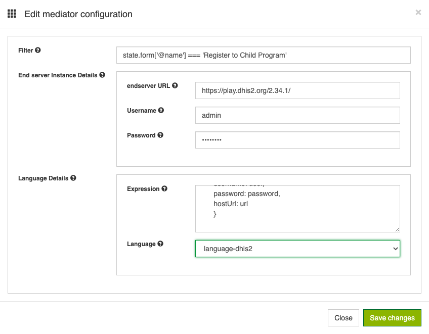
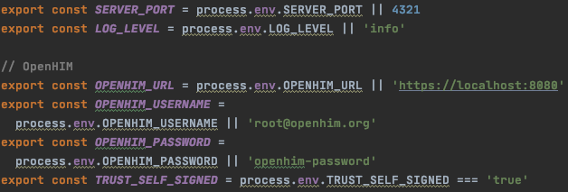
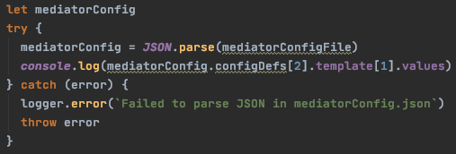

[uri_license]: http://www.gnu.org/licenses/agpl.html
[uri_license_image]: https://img.shields.io/badge/License-AGPL%20v3-blue.svg

[![License: AGPL v3][uri_license_image]][uri_license]

## Useful links
* Additional information on mediators and configuration: http://openhim.org/docs/dev-guide/developing-mediators/
* OpenFN github repositories (inc. languages): https://github.com/OpenFn/
* OpenFN platform, which influenced this project https://www.openfn.org/
* To manually install and setup mongodb when not using docker (requirement for the manual installation of openhim) : https://docs.mongodb.com/manual/installation/ 
* If you want to install openHIM manually: http://openhim.org/docs/installation/manual
* If you want to install openHIM with npm: http://openhim.org/docs/installation/npm

# Openhim mediator with openFN

For easy usage of the platform, using docker is advised. It can be downloaded from [here](https://www.docker.com/)

To start using OpenHIM and the provided mediator following steps should be followed:

1 - Go to the network directory and run ``` docker-compose up ```. This is provided by the openHIM team to easily setup the platform and its database.

2 - After having the openhim network running, follow step 3 to 5 of the openHIM [tutorial](https://github.com/jembi/openhim-mediator-tutorial/blob/master/0_Starting_OpenHIM.md)

3 - Go back to the root directory and run ```docker build -t mediator . ```. The name mediator is arbritrary but you should remember it as it is how you will access your mediator. 

4 - Run the command ``` docker run -e OPENHIM_URL=https://openhim-core:8080 -e TRUST_SELF_SIGNED=true -e OPENHIM_PASSWORD=password -e SERVER_PORT=4321 --network network_openhim --name mediator --rm mediator ```. Replace "mediator" with the name that you chose in step 2.

5- Platform should be accessible under localhost:9000.

6- For it to be accessible in a different host, you will have to follow following steps:

    6.1 - First modify the host parameter in the file "network/default" to your external host.
  
    6.2 - You will have to create a certificate in your external host for it to be secure to access. One way to do this, is by installing certbot and running
    ```certbot —nginx -d YOUR-HOST```
    
    6.3 - The certificates will now have to be copied to the containers as well, which is done in the docker-compose file. Make sure to alter the YOUR-HOST part in the docker-compose to fit your certificate path and in the default.conf file. 
  
    6.4 - The configuration inside the container has also to be altered, so that it takes the certificates, this is also done in the docker-compose by pushing the configuration files inside openhim-core-conf folder. 
  NOTE: if you only want to use it locally on your localhost, just use the docker-compose file provided by the openhim in the tutorial above. 

7- By clicking on the mediator tab, you will see all mediators registered in the platform. Here you should see the mediator created with step 3 and 4. By clicking in the settings icon, you will be able to configure your job.


8- A configuration menu will open. In the first window, you can define the trigger, which if met, will continue with the execution of the provided expression. In the second window, you may specify the URL of the endserver as well as the corresponding credentials. In the last window, is where you can provide the expression, which corresponds to the action you wish to perform on the endserver, as well as the language that this action requires, e.g. for an action on the dhis2 server you would require the language-dhis2. 



## Configuration

To configure the openhim credentials, URL and the port of the server without using the environment variables within the docker command, you can access the file in src/config/config.js and change the according variables.



To configure the mediator itself e.g. the name or the fields shown in the platform, you can easily edit the file "mediatorConfig.json". In the following image you can see how the sector for the external server on the platform (with the expression and language was created). To group similar parameters you can use a struct, for a large open field you can use bigstring and so on. Check the useful links for more on this. 


Additionally you can access the variables and even change them in the script "openhim.js" where the mediator configuration is parsed. In the following snippet, the list of languages in, shown in the previous image is accessed and printed. Analog to this, you can access the name and other parameters as well. 




